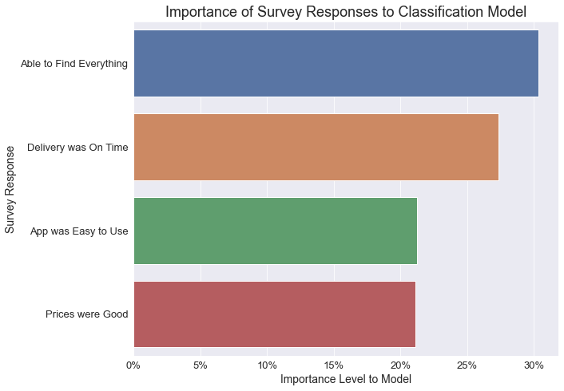

Likert scale survey data was collected from a customer cohort and responses were used to develop a Random Forest classification model to predict what aspects of the ordering and delivery process were most likely to lead to customer happiness.

<!--more-->

The model suggests the most important characteristics leading to customer happiness were `Find Everything Customer Wanted` (30.3%) and `On Time Delivery` (27.3%).
